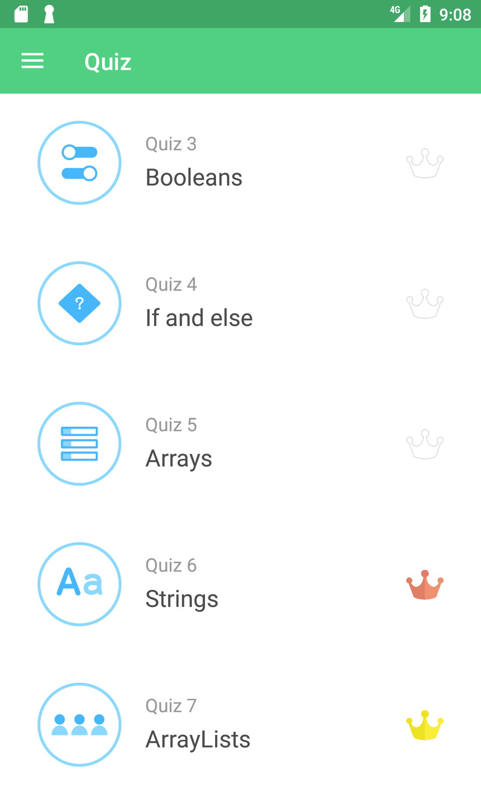
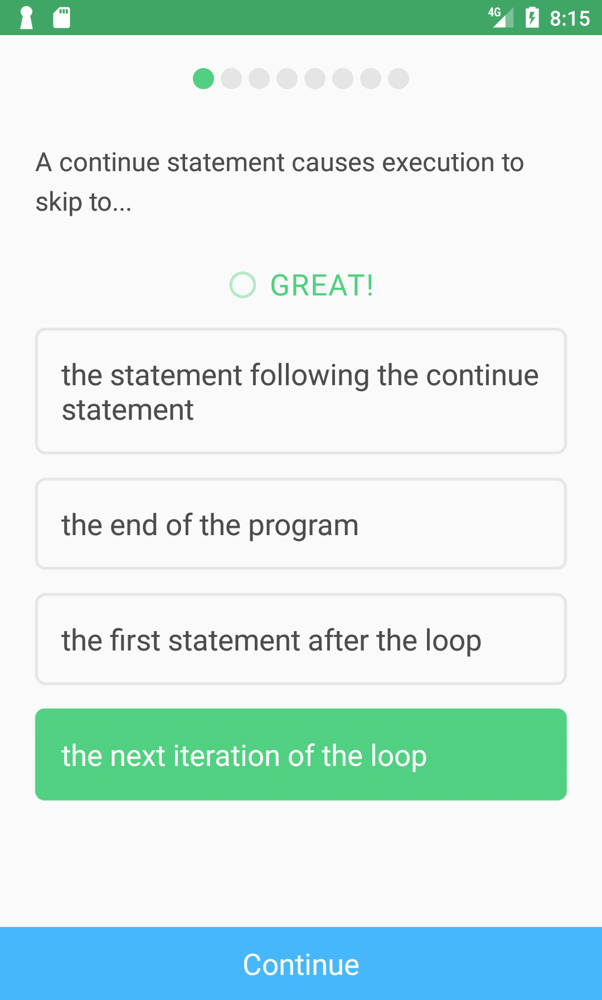
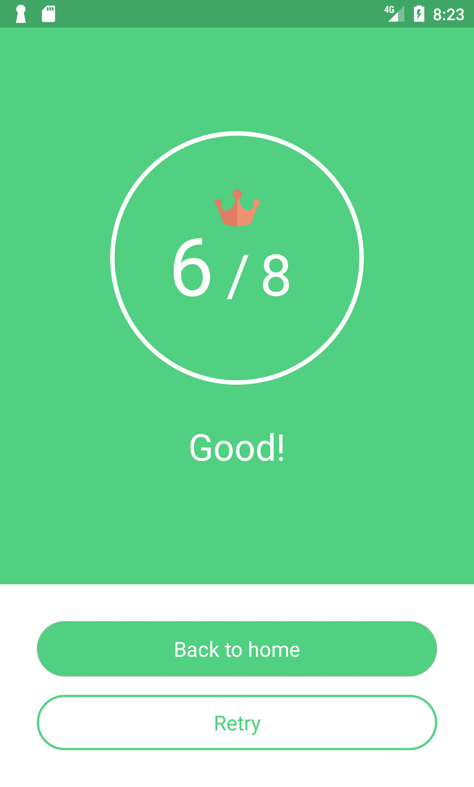
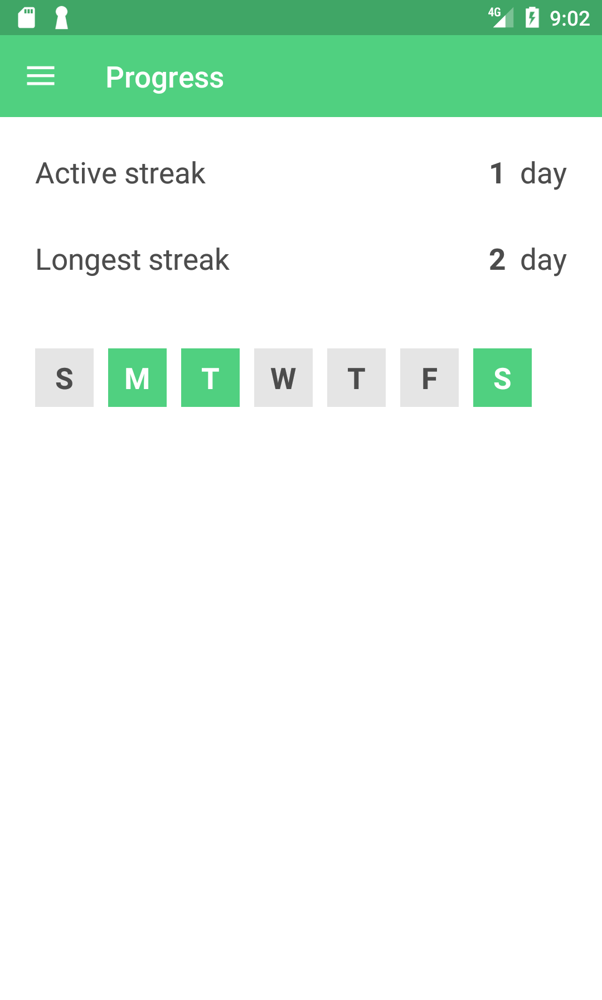

# JavaQ
This is an Android basic Java quiz App. Now it's on the store!!
Pls visit below website if you want to download.
https://play.google.com/store/apps/details?id=com.mina.aki.javaq&hl=ja

      

## Contents of Quiz
- Basic concepts
- Variables
- Booleans
- If and else
- Arrays
- Strings
- ArrayLists
- Loops
- Methods
- Classes

## What you can do with our App
You can record your progress of your study.
You can check your record of active streak and longest streak on progress page.
